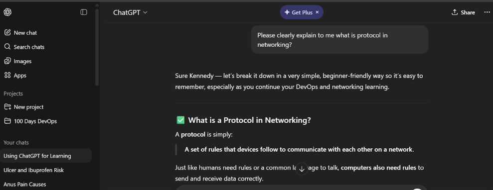
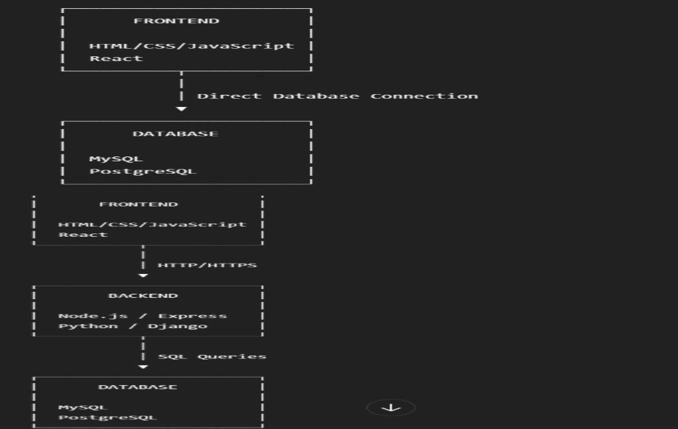
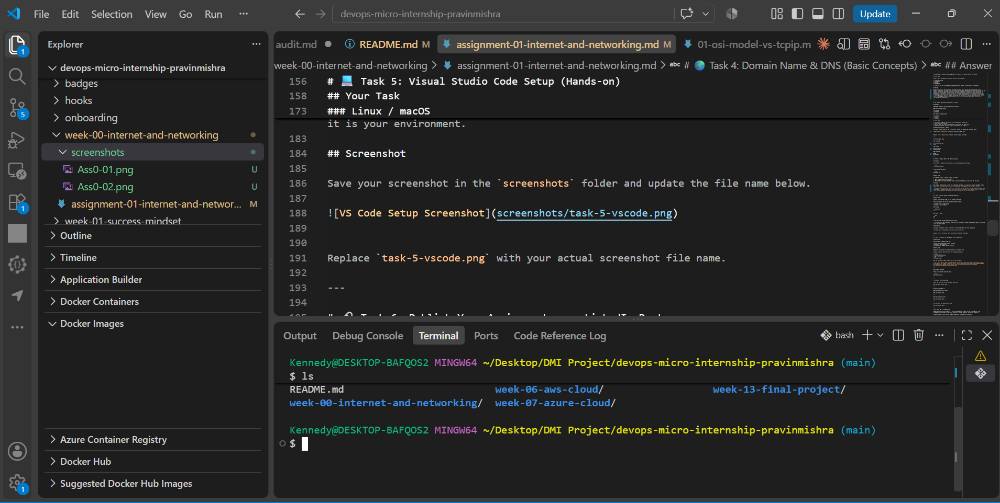

# Week 00 - Internet and Networking

Part of the DevOps Micro Internship (DMI) Cohort 3 with Agentic AI

---

# 🧑‍💻 Task 1: Using ChatGPT as Your Learning Assistant

## Scenario

You're new to DevOps and will frequently encounter technical questions. ChatGPT can be your learning companion.

## Your Task

Write a clear ChatGPT prompt to help you understand:

> "What is a protocol in networking? Explain with a simple real-life example."

Take a screenshot of your interaction showing:

* Your detailed prompt (with clear expectations)
* ChatGPT's simplified response with an example

## Screenshot

Save your screenshot in the `screenshots` folder and update the file name below.




Replace `task-1-chatgpt.png` with your actual screenshot file name.

---

## What I Learned (2–3 lines)

A protocol is simply:
A set of rules that devices follow to communicate with each other on a network.
Just like humans need rules or a common language to talk, computers also need rules to send and receive data correctly.


---

# 🌐 Task 2: Internet and Networking

## Scenario

Your friend is launching an online bookstore named **EpicReads**.

He asked you to explain how users globally can access his website hosted in Finland.

## Your Task

Write a short explanation (**100–150 words**) that includes:

* Packet Switching
* IP Address
* TCP/IP
* HTTP/HTTPS

💡 **Tip:** You may use ChatGPT (as demonstrated in Task 1) to refine your explanation.

## Answer

Packet switching is the process of breaking data into small packets and sending them across a network, where they may take different routes before being reassembled at their destination. An IP address is a unique numerical identifier assigned to a device, allowing it to be identified and communicate on a network. TCP/IP is the set of communication protocols that enables devices to exchange data reliably across the internet. TCP helps ensure packets are delivered correctly and in the right order, while IP handles addressing and routing. HTTP and HTTPS are protocols used to transfer web pages between browsers and web servers. HTTPS provides additional security by encrypting the communication.


---

# 🏗️ Task 3: Application Architecture & Stack

## Scenario

EpicReads bookstore has two application versions:

### Two-Tier Application

* Frontend
* Database

### Three-Tier Application

* Frontend
* Backend
* Database

## Your Task

* Draw simple diagrams (hand-drawn or tool-based such as draw.io)
* Label each layer clearly
* List at least two common technologies or tools used for each layer
* Submit a screenshot or photo clearly showing your own drawing

## Diagram Screenshot / Photo

Save your diagram image in the `screenshots` folder and update the file name below.




Replace `task-3-diagram.png` with your actual diagram file name.

---

## Technologies Used

### Frontend

HTML/CSS/JavaScript
React

### Backend

Node.js/Express
Python/Django

### Database

MySQL, 
PostgreSQL

---

# 🌍 Task 4: Domain Name & DNS (Basic Concepts)

## Scenario

Your friend's bookstore **EpicReads** is currently accessible through:

```text
52.172.142.222:3000
```

He purchased the domain:

```text
epicreads.com
```

## Your Task

In **50–100 words**, explain in your own words:

1. What is DNS (Domain Name System)?
2. Which DNS record type should be used to connect the domain to the given IP, and why?

## Answer

DNS (Domain Name System) is like the internet’s phonebook. It translates easy-to-remember domain names, such as **epicreads.com**, into IP addresses that computers use to locate servers.

To connect **epicreads.com** to **52.172.142.222**, an **A (Address) record** should be used. An A record maps a domain name directly to an IPv4 address. Therefore, when someone enters **epicreads.com** in their browser, DNS can direct them to the server at **52.172.142.222**.


---

# 💻 Task 5: Visual Studio Code Setup (Hands-on)

## Your Task

Install Visual Studio Code (if not already installed).

Take a screenshot of your VS Code environment showing:

* Terminal open inside VS Code
* Running a basic command:

### Windows

```powershell
dir
```

### Linux / macOS

```bash
pwd
ls
```

* Your selected VS Code theme clearly visible

⚠️ **Important:** The screenshot must show your username or another identifiable detail to confirm it is your environment.

## Screenshot

Save your screenshot in the `screenshots` folder and update the file name below.




Replace `task-5-vscode.png` with your actual screenshot file name.

---

# 🔗 Task 6: Publish Your Assignment as a LinkedIn Post

## Objective

Publishing on LinkedIn helps you:

* Build your professional online presence
* Reinforce your learning
* Document your DevOps journey publicly

## Your Task

Summarize your answers from Tasks 1–5 into a LinkedIn post.

Clearly structure your post into the following sections:

* ChatGPT
* Internet & Networking
* App Architecture
* DNS
* VS Code Setup

Use the credit note that matches your track:

Add the following credit note at the end of your post **(If you are DMI Cohort 3 student)**:

> **P.S. This post is part of the DevOps Micro Internship (DMI) with Agentic AI — Cohort 3 — by Pravin Mishra. My graded progress is public: https://dmi.pravinmishra.com/s/YOUR-GITHUB-USERNAME.html · Start your DevOps journey: https://dmi.pravinmishra.com/?utm_source=student&utm_medium=ps-linkedin&utm_campaign=cohort3**


Add the following credit note at the end of your post **(If you are DMI Self-paced track student)**:

> **P.S. This post is part of the DevOps Micro Internship (DMI) — Self-Paced Engineer Track — by Pravin Mishra. My graded progress is public: https://dmi.pravinmishra.com/s/YOUR-GITHUB-USERNAME.html · Start your DevOps journey: https://dmi.pravinmishra.com/?utm_source=student&utm_medium=ps-linkedin&utm_campaign=self-paced**

Add the following credit note at the end of your post **(If you are DMI Campus student)**:

> **P.S. This post is part of the DevOps Micro Internship (DMI) — Campus — by Pravin Mishra. My graded progress is public: https://dmi.pravinmishra.com/s/YOUR-GITHUB-USERNAME.html · Start your DevOps journey: https://dmi.pravinmishra.com/?utm_source=student&utm_medium=ps-linkedin&utm_campaign=campus**

Replace `YOUR-GITHUB-USERNAME` with your GitHub username — that link is your public DMI progress page (your graded badge page).
---

## LinkedIn Post URL

Paste your LinkedIn post URL here:

```text
https://www.linkedin.com/posts/kennedy-nwachukwu-601466170_im-pleased-to-share-my-recent-progress-from-share-7423428850161811456-Glfe/?utm_source=share&utm_medium=member_desktop&rcm=ACoAACilgeEBgxwh_-W79kFyWdCZeNgA2BEfYRQ```

---

## LinkedIn Post Backup Copy

Paste the full text of your LinkedIn post here:

I’m pleased to share my recent progress from completing a series of practical tasks in a DevOps micro-internship. This experience allowed me to combine learning with hands-on practice and strengthen my understanding of core DevOps and networking concepts.

Here’s what I worked on:

ChatGPT as a Learning Assistant
I leveraged ChatGPT to break down complex technical topics into simple explanations. For example, I used it to understand networking protocols through clear definitions and relatable real-life examples, which made learning more effective.

Internet & Networking
 I explored how websites are accessible globally by understanding Packet Switching, IP Addresses, TCP/IP, and HTTP/HTTPS. These technologies enable reliable, fast, and secure communication between users and servers anywhere in the world.

Application Architecture
 I studied both two-tier (Frontend + Database) and three-tier (Frontend + Backend + Database) architectures, identified tools used at each layer, and created diagrams to better visualize how modern applications are structured.

DNS & Domain Mapping
 I learned how the Domain Name System converts domain names into IP addresses and configured an A record to connect epicreads.com to its server, improving accessibility for users.

VS Code Setup
 I set up Visual Studio Code with the integrated terminal, practiced essential Linux commands, and customized my development environment to support efficient coding and DevOps workflows.

Overall, this internship strengthened my technical foundation and gave me more confidence working with real-world DevOps tools and systems. I’m excited to keep learning and building.

P.S. This post is part of the FREE DevOps Micro Internship Cohort run by Pravin Mishra. You can start your DevOps journey for free from his YouTube Playlist.

---

# Reflection – Week 0

### What did you find easy?

I found understanding the basic concepts of application architecture, DNS, IP addresses, and how different application layers communicate relatively easy. Drawing and identifying the frontend, backend, and database layers also helped me understand how applications are structured.

---

### What was difficult?

The most difficult part was understanding how the different layers communicate, especially the difference between a two-tier and three-tier application. Understanding DNS records and how a domain name connects to an IP address also required some attention.

---

### What will you improve next week?

Next week, I will improve my understanding of networking and application architecture. I will also practice creating architecture diagrams and learn more about how DNS, HTTP/HTTPS, TCP/IP, and cloud services work together in real-world applications.

---

## 📌 About DMI & CloudAdvisory

DevOps Micro Internship (DMI) is a project-based DevOps program run by Pravin Mishra (The CloudAdvisory) focused on real-world execution, systems thinking, and career readiness.

It helps learners build strong DevOps foundations with hands-on experience.


## 📌 Resources

- 🌐 **DMI Official Website:** https://dmi.pravinmishra.com?utm_source=github&utm_medium=readme  
- 🎓 **University:** https://university.pravinmishra.com?utm_source=github&utm_medium=readme  
- 💬 **Discord Community:** https://discord.pravinmishra.com?utm_source=github&utm_medium=readme  
- 📝 **Blog:** https://dmi.pravinmishra.com/blog?utm_source=github&utm_medium=readme  
- ▶️ **YouTube Playlist (DMI Cohort 3):** https://www.youtube.com/playlist?list=PLFeSNDtI4Cho  
- 🔗 **Pravin Mishra (LinkedIn):** https://www.linkedin.com/in/pravin-mishra-aws-trainer/  
- 🏢 **CloudAdvisory (LinkedIn):** https://www.linkedin.com/company/thecloudadvisory/

---

*This submission is part of DevOps Micro Internship (DMI) Cohort 3 — Agentic AI Track*