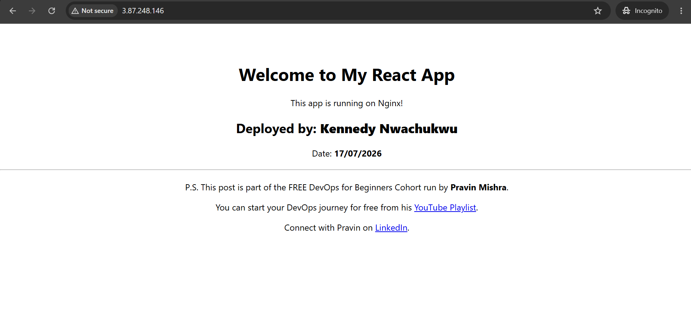
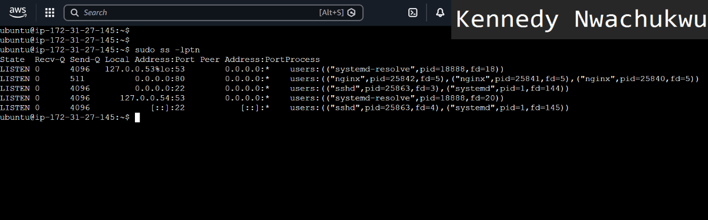
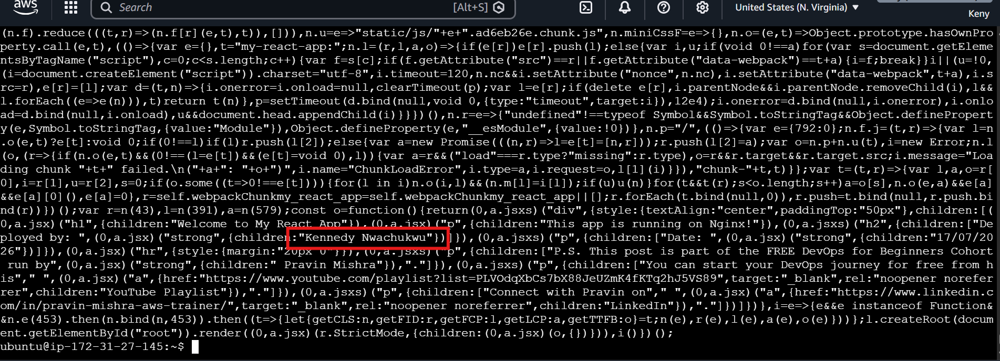
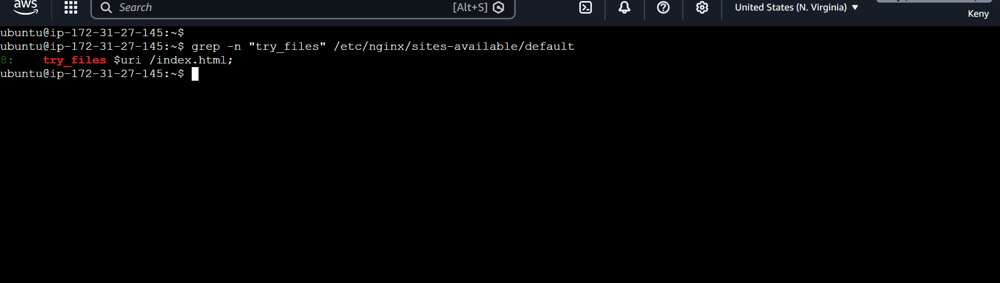
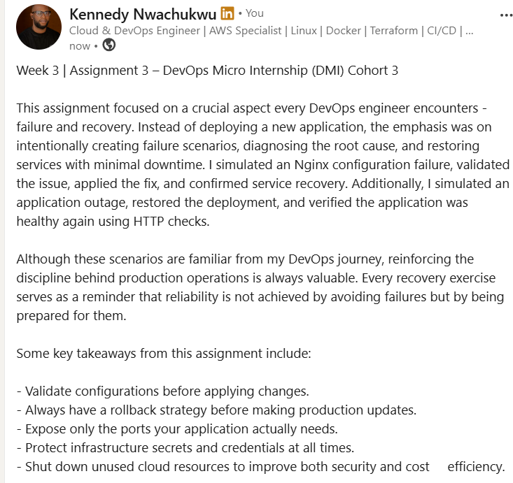

# Assignment 3 — Production Maintenance Drill (OPS Checklist)

Part of the DevOps Micro Internship (DMI) Cohort 3 with Agentic AI

---

## Purpose

In this assignment, you will treat your already deployed React application (on Ubuntu VM with Nginx) as a live production system. You will perform structured operational checks covering network validation, service health, log analysis, resource monitoring, configuration verification, and incident simulation with recovery — mirroring real on-call DevOps responsibilities.

---

# Task 1 — Server Access & Networking Validation

## Goal

Verify that the deployed React application is reachable from the browser and confirm basic network connectivity of the Ubuntu VM.

### Evidence

#### Screenshot 1 — Browser showing the React app with your Full Name visible on the UI

---

#### Screenshot 2 — Output of `ip a`

---

#### Screenshot 3 — Output of `sudo ss -tulpen`

---

#### Screenshot 4 — Output of `sudo ufw status`

---

### Notes

Answer the following in your own words:

**1. What proves Nginx is listening on 0.0.0.0:80?**

Nginx is confirmed to be listening because the output shows it is bound to 0.0.0.0:80. This means the web server is accepting HTTP connections on port 80 from any network interface, allowing users to access the application through the server's public IP address.
---

**2. What proves SSH is active on port 22?**

SSH is active because the output shows that port 22 is in the LISTEN state. This confirms that the SSH service is running and ready to accept secure remote connections to the Ubuntu server.
---

**3. Did you find any unexpected open ports? Explain briefly.**

No, I did not find any unexpected open ports. The open ports matched the services I had intentionally configured, with port 22 used for SSH access and port 80 used by Nginx to serve the React application. This indicates the server is exposing only the necessary services.
---

# Task 2 — Service Health & Systemd Validation (Nginx)

## Goal

Verify that Nginx is properly installed, running, enabled at boot, and safely configured.

### Evidence

#### Screenshot 1 — Output of `systemctl status nginx --no-pager`

---

#### Screenshot 2 — Output of `sudo nginx -t`

---

#### Screenshot 3 — Output of `sudo ss -lptn '( sport = :80 )'`

---

### Notes

Answer the following in your own words:

**1. What happens if Nginx fails to restart in production?**

If Nginx fails to restart, the website or application it serves will become unavailable to users. This can result in downtime, failed requests, and a poor user experience until the issue is identified and the service is restored.
---

**2. What's your basic rollback plan?**

My first step would be to restore the last known working Nginx configuration or application files from a backup. After that, I would test the configuration, restart Nginx, and verify that the application is accessible before making any further changes.
---

# Task 3 — Logs & Request Trace

## Goal

Verify real traffic flow and analyze logs to understand system behavior and errors.

### Evidence

#### Screenshot 1 — Output of `sudo tail -n 30 /var/log/nginx/access.log`

---

#### Screenshot 2 — Output of `sudo tail -n 30 /var/log/nginx/error.log`

---

#### Screenshot 3 — Output of `sudo journalctl -u nginx --no-pager -n 50`

---

### Notes

Answer the following in your own words:

**1. Were there any errors in the logs?**

- If yes, mention 1–2 example error lines from the logs and explain what each one means in simple terms.
- If no, explain what it means if the error log is empty or shows no recent errors during your check.

There were no actual application errors in the Nginx error log during my check. The only entry I found was:

2026/07/17 07:39:43 [notice] 25242#25242: using inherited sockets from "5;6;"

This is a notice, not an error. It simply means Nginx restarted or reloaded successfully and continued using the existing network sockets without interrupting active connections.

---

**2. If there were no errors, what does that indicate about the system?**

The absence of errors in the Nginx error log indicates that the web server is running normally. It suggests that the configuration is valid, the service is stable, and requests are being handled successfully without any issues that require attention.
---

**3. Based on the access logs, were your curl requests visible in the log entries? What does that prove about traffic flow?**

Yes. My requests were visible in the access log. For example, I could see requests coming from my public IP (102.91.98.159) for the homepage and the React application's CSS and JavaScript files.
This proves that traffic is successfully reaching the Nginx server, the server is processing the requests, and it is responding correctly by serving the application files. It also confirms that logging is working as expected, making it easier to monitor and troubleshoot incoming traffic.
---

# Task 4 — System Resource Health Check (Capacity Red Flags)

## Goal

Assess server capacity and detect potential performance or failure risks.

### Evidence

#### Screenshot 1 — Output of `uptime`

---

#### Screenshot 2 — Output of `free -h`

---

#### Screenshot 3 — Output of `df -h`

---

#### Screenshot 4 — Output of `sudo du -sh /var/* | sort -h`

---

### Notes

Answer the following in your own words:

**1. Which resource looks most critical right now? (CPU/load, memory, or disk) Explain why.**

The disk is the resource I would pay the most attention to. Although it is only 59% used at the moment, disk space is finite and can fill up over time because of logs, application files, or other data. The CPU load is 0.00, which means the server is under almost no processing pressure, and there is still over 500 MB of available memory, so those resources are currently in a healthy state.
---

**2. What happens if disk becomes 100% full in a production server?**

If the disk reaches 100% capacity, the server may no longer be able to write log files, save application data, or create temporary files. This can cause applications and services to fail unexpectedly, and in some cases, users may no longer be able to access the application until disk space is freed. Monitoring disk usage and cleaning up unnecessary files regularly helps prevent this situation.
---

# Task 5 — Configuration & Deployment Verification

## Goal

Ensure the correct React build is deployed and Nginx is serving it properly.

### Evidence

#### Screenshot 1 — Output of `ls -lah /var/www/html | head -n 20`

---

#### Screenshot 2 — Output of `grep -R "Deployed by" -n /var/www/html 2>/dev/null | head`

---

#### Screenshot 3 — Output of `grep -n "try_files" /etc/nginx/sites-available/default`

---

### Notes

Answer the following in your own words:

**1. How do you confirm that the correct version of the application is deployed?**

I confirm the correct version by opening the application in a web browser and checking that the latest changes I made, such as my name and the current date, are displayed. I can also verify the deployed files on the server or search for a deployment marker to ensure the newest build is the one currently being served by Nginx.
---

# Task 6 — Nginx Configuration Failure Simulation

## Goal

Simulate a real-world Nginx misconfiguration and recover the service safely.

### Evidence

#### Screenshot 1 — Output of `sudo nginx -t` showing the syntax error (broken config)

---

#### Screenshot 2 — Output of `sudo nginx -t` showing syntax ok (fixed config)

---

#### Screenshot 3 — Output of `curl -I http://<public-ip>` confirming recovery (200 OK)

---

### Notes

Answer the following in your own words:

**1. What caused the configuration failure?**

The configuration failed because I intentionally introduced a syntax error into the Nginx configuration file. Since Nginx validates its configuration before applying changes, it detected the mistake and reported an error during the configuration test.
---

**2. How did you fix the issue?**

I reopened the Nginx configuration file, identified the syntax mistake, corrected it, and then ran sudo nginx -t again to confirm the configuration was valid. After the test passed successfully, I reloaded Nginx to apply the corrected configuration.
---

**3. How can you avoid this kind of issue in real production systems?**

Before making configuration changes, I would always create a backup and test the configuration with nginx -t. I would also use version control for configuration files and review changes carefully before deploying them to production.
---

# Task 7 — Web Application Failure Simulation

## Goal

Simulate missing deployment content and recover the application safely.

### Evidence

#### Screenshot 1 — Output of `curl -I http://<public-ip>` showing failure (non-200 response)

---

#### Screenshot 2 — Output of `curl -I http://<public-ip>` confirming recovery (200 OK)

---

### Notes

Answer the following in your own words:

**1. What caused the application to break in this scenario?**

The application stopped working because the main application file was no longer available in the Nginx web root. Without the required files, Nginx could not serve the application correctly, resulting in an error response.

---

**2. How did you fix the issue and restore the application?**

I restored the missing application file to its original location and verified that Nginx could serve it again. After confirming everything was back in place, I tested the application and received a successful HTTP 200 response.
---

**3. What steps would you take to prevent this kind of issue in real production systems?**

I would keep backups of deployed files, automate deployments through a CI/CD pipeline, test changes before deploying, and use version control so I can quickly restore a working version if something goes wrong.
---

# Task 8 — Security & Reliability Review

## Goal

Review and reflect on the security and reliability practices applied during this assignment.

### Security & Reliability Notes

Answer the following in your own words:

**1. Why is SSH key-based authentication more secure than sharing passwords?**

SSH keys provide stronger authentication because they use cryptographic encryption instead of passwords that can be guessed or stolen. Private keys also never leave my computer, making unauthorized access much more difficult.

---

**2. Why should only required ports be open on a production server?**

Only opening the ports that are actually needed reduces the server's attack surface. This lowers the chances of attackers exploiting unnecessary services or gaining unauthorized access.

---

**3. Why is it important for Nginx to be enabled on boot?**

Enabling Nginx on boot ensures the web server starts automatically whenever the server restarts. This reduces downtime and allows users to access the application without requiring manual intervention.

---

**4. What are the risks of sharing secrets, keys, or credentials publicly?**

If secrets or credentials are exposed, unauthorized users could access cloud resources, modify infrastructure, steal sensitive information, or generate unexpected costs. Keeping credentials private is essential for maintaining security.

---

**5. Why should cloud resources be stopped or terminated when they are no longer needed?**

Stopping or terminating unused cloud resources helps reduce unnecessary costs and minimizes security risks. It also ensures resources are only running when they are actively needed.

---

# LinkedIn Post (Required)

## Evidence

#### LinkedIn Post URL

Paste your LinkedIn post URL here:

https://www.linkedin.com/posts/kennedy-nwachukwu-601466170_devops-aws-nginx-share-7485201894445920257-Ab_s/?utm_source=share&utm_medium=member_desktop&rcm=ACoAACilgeEBgxwh_-W79kFyWdCZeNgA2BEfYRQ
---

#### Screenshot — Published LinkedIn post

---

# Submission Instructions

- Add all required screenshots in your submission
- Full name must be visible in required screenshots
- Do not expose sensitive information (keys, passwords, account IDs)

---

# Completion Checklist

- [ ] Task 1: Screenshots (browser, ip a, ss -tulpen, ufw status) + Notes answered
- [ ] Task 2: Screenshots (nginx status, nginx -t, ss port 80) + Notes answered
- [ ] Task 3: Screenshots (access log, error log, journalctl) + Notes answered
- [ ] Task 4: Screenshots (uptime, free -h, df -h, du -sh) + Notes answered
- [ ] Task 5: Screenshots (ls html, grep deployed by, grep try_files) + Notes answered
- [ ] Task 6: Screenshots (nginx -t fail, nginx -t pass, curl recovery) + Notes answered
- [ ] Task 7: Screenshots (curl failure, curl recovery) + Notes answered
- [ ] Task 8: Security & Reliability Notes answered
- [ ] LinkedIn post published and URL submitted
- [ ] Full Name visible in all required screenshots
- [ ] No sensitive data exposed

---

## 📌 About DMI & CloudAdvisory

DevOps Micro Internship (DMI) is a project-based DevOps program run by Pravin Mishra (The CloudAdvisory) focused on real-world execution, systems thinking, and career readiness.

It helps learners build strong DevOps foundations with hands-on experience.

---

## 📌 Resources

- 🌐 DMI Official Website: https://pravinmishra.com/dmi  
- 🎓 DevOps for Beginners (Udemy): https://www.udemy.com/course/devops-for-beginners-docker-k8s-cloud-cicd-4-projects/  
- 🎓 Agentic AI DevOps with Claude Code: https://www.udemy.com/course/ultimate-agentic-ai-devops-with-claude-code/  
- 🎓 DevOps with Claude Code: Terraform, EKS, ArgoCD & Helm: https://www.udemy.com/course/devops-with-claude-code-terraform-eks-argocd-helm/  
- ▶️ YouTube Playlist: https://www.youtube.com/playlist?list=PLFeSNDtI4Cho  
- 🔗 Pravin Mishra (LinkedIn): https://www.linkedin.com/in/pravin-mishra-aws-trainer/  
- 🏢 CloudAdvisory (LinkedIn): https://www.linkedin.com/company/thecloudadvisory/

---

*This submission is part of DevOps Micro Internship (DMI) Cohort 3 — Agentic AI Track.*