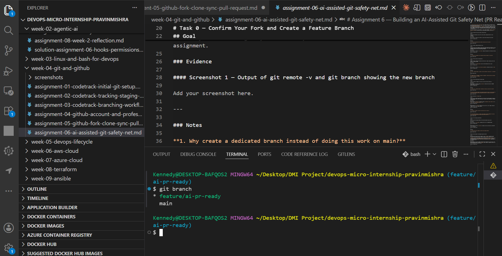
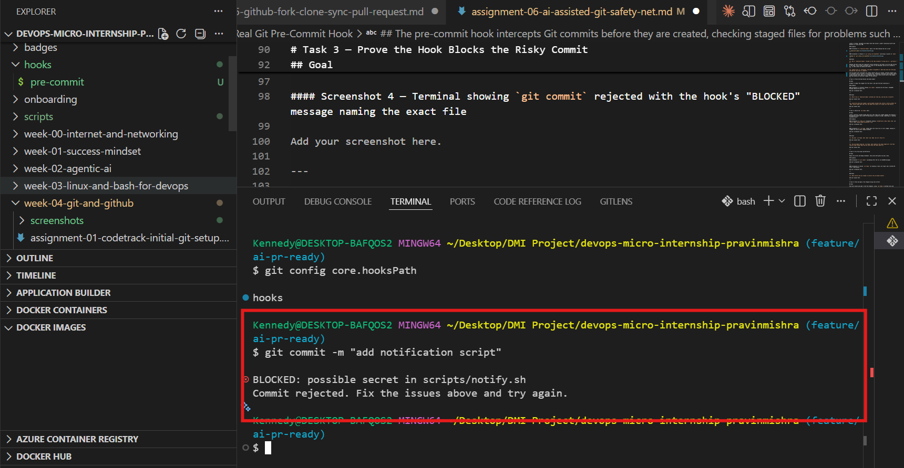
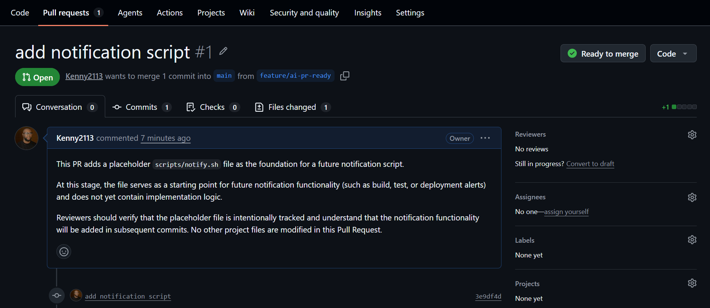

# Assignment 6 — Building an AI-Assisted Git Safety Net (PR Ready Check)

Part of the DevOps Micro Internship (DMI) Cohort 3 with Agentic AI

---

## Purpose

In Week 2 you built Claude Code hooks that block a dangerous action *before* it happens (`PreToolUse`), and a restricted skill that could look but not touch (`allowed-tools` without `Write`). In this assignment you will discover that Git has the exact same idea, decades older: a **pre-commit hook** that blocks a commit before it's created.

You will build both halves of a real "PR Ready" workflow:

1. A **Git hook that follows fixed rules** — scans staged changes for hardcoded secrets and oversized files and refuses the commit. No AI involved, no guessing, just a rule that gives the same answer every time.
2. A **restricted Claude Code skill** (`/pr-ready`) that reads your staged diff and drafts a Pull Request title, description, and a short list of things worth a second look — the kind of judgment a fixed rule can't make (mixed changes, missing context, unclear intent). The skill never commits, pushes, or opens the PR. You do that yourself, using its draft as a starting point.

This mirrors the Agentic Loop from Week 3's Linux triage assignment: **Gather → Analyze → Human Act → Verify**. The hook and the skill both gather and analyze; only you act.

---

# Task 0 — Confirm Your Fork and Create a Feature Branch

## Goal

Confirm you are working in your own fork, then create a dedicated branch for this assignment.

### Evidence

#### Screenshot 1 — Output of git remote -v and git branch showing the new branch

---

### Notes

**1. Why create a dedicated branch instead of doing this work on main?**

A dedicated branch isolates my changes from the main branch, making it safer to develop, test, and review updates before merging them into the main codebase.
---

# Task 1 — Stage a Change With Realistic Risk

## Goal

On your own fork of this repository (the one you've been submitting your DMI work in since onboarding), create a new branch and stage a change that a real reviewer should catch: a hardcoded-looking secret and a leftover debug statement.

### Evidence

#### Screenshot 1 — Output of  `git status` showing the staged file on feature/ai-pr-ready

---

### Notes

**1. Why does this assignment use an obviously fake key instead of a real one?**

A fake key is used so we can practice detecting hardcoded secrets without exposing real credentials or creating a security risk.
---

# Task 2 — Write a Real Git Pre-Commit Hook

## Goal

Create a tracked, shareable pre-commit hook that blocks a commit containing secret-like patterns or files over 1MB.

### Evidence

#### Screenshot 2 — `hooks/pre-commit` open in VS Code showing the full script

---

#### Screenshot 3 — Output of `git config core.hooksPath` confirming it points to `hooks`

---

### Notes

**1. Why is `hooks/pre-commit` tracked in the repo instead of living only in `.git/hooks/`?**

Keeping the hook inside the repository allows everyone on the team to use the same version of the hook. Files inside .git/hooks are local to one developer and are not tracked by Git, so they cannot be shared with others.
---

**2. Compare this to `PreToolUse` from Week 2 Assignment 6. What does each one intercept, and what do they have in common?**

The pre-commit hook intercepts Git commits before they are created, checking staged files for problems such as secrets or oversized files. PreToolUse intercepts tool actions before Claude executes them. Both act as safeguards that stop risky actions before they happen, but they operate at different stages of the workflow.
---

# Task 3 — Prove the Hook Blocks the Risky Commit

## Goal

Attempt to commit the staged file from Task 1 and show the hook rejecting it.

### Evidence

#### Screenshot 4 — Terminal showing `git commit` rejected with the hook's "BLOCKED" message naming the exact file

---

### Notes

**1. Which line in `hooks/pre-commit` matched your fake key, and why did it match?**

This line matched:
Example AWS key:
AKIA_EXAMPLE_KEY_NOT_REAL
because the hook searches for strings that match the regular expression:
AKIA[0-9A-Z]{16}
which looks like an AWS Access Key ID.
---

**2. Could this hook have caught a poorly-named variable that stores a secret without the `AKIA` prefix? What does that tell you about the limits of a fixed rule like this?**

No. The hook only looks for predefined patterns such as AWS keys or private key headers. If a secret were stored in a different format or under another variable name that did not match the pattern, the hook would not detect it. This shows that fixed-rule detection has limitations and cannot identify every possible secret.
---

# Task 4 — Build the `/pr-ready` Skill

## Goal

Create a manually invoked Claude Code skill that reads your staged changes and produces a PR-readiness report and a draft PR description — without writing, committing, or pushing anything itself.

### Evidence

#### Screenshot 5 — `SKILL.md` frontmatter showing `allowed-tools: Bash, Read, Grep` (no `Write`) and `disable-model-invocation: true`

---

#### Screenshot 6 — `/pr-ready` output while the risky file is still staged, showing it flagged the secret and/or debug statement

---

### Notes

**1. Why does `/pr-ready` have `Bash` and `Read` but not `Write`?**

/pr-ready is designed to review staged changes without modifying them. Bash lets it run Git commands, Read allows it to inspect files, and Grep helps search for patterns such as secrets or debug statements. Write permission is intentionally excluded to ensure the skill cannot change files or perform actions that should remain under human control.
---

**2. The pre-commit hook and `/pr-ready` both looked at the same staged diff. Did they flag the same things? What did one catch that the other didn't?**

Both detected the hardcoded AWS access key in the staged changes. The pre-commit hook blocked the commit automatically because it matches predefined rules for secrets. The /pr-ready skill also identified the secret but went further by highlighting the debug echo statement and producing a draft Pull Request title and description. The hook enforces rules, while the AI skill provides a broader review and helpful suggestions.
---

# Task 5 — Fix the Issues and Re-Verify

## Goal

Remove the secret and debug statement, then prove both gates now pass clean.

### Evidence

#### Screenshot 7 — `git commit` succeeding after the fix (no BLOCKED message)

---

#### Screenshot 8 — Second `/pr-ready` run showing a clean risk report and a drafted PR title + description

---

### Notes

**1. What exactly did you change to satisfy the pre-commit hook?**

I removed the hardcoded fake AWS access key and deleted the debug echo statement that exposed it. This eliminated the secret-like pattern detected by the hook, allowing the commit to proceed successfully.
---

# Task 6 — Push and Open a Pull Request Using the AI Draft

## Goal

Push your branch and open a real Pull Request, using `/pr-ready`'s drafted title and description as your starting point — read it critically and edit before you use it.

**Important:** Open this Pull Request with base repository set to **your own fork** — not the shared upstream `pravinmishraaws/devops-micro-internship-pravinmishra` repository. This assignment's hook and skill files are your own practice work, not a change meant for the shared class repo.

### Evidence

#### Screenshot 9 — Your Pull Request showing the base repository is your own fork, plus the title and description, with the `/pr-ready` draft visible for comparison (paste it in the PR conversation or your notes below)

---

#### PR Link

https://github.com/Kenny2113/devops-micro-internship-pravinmishra/pull/1
---

### Notes

**1. What, if anything, did you edit in the AI's drafted PR description before using it? Why?**

I edited the AI-generated description to make it clearer and more concise. I removed unnecessary wording, clarified that the file is currently a placeholder, and ensured the description accurately reflected the changes in the Pull Request before submitting it.
---

**2. If you had blindly copy-pasted the AI's draft without reading it, what could go wrong?**

If I had copied the AI's draft without reviewing it, it could have contained inaccurate or incomplete information that did not match my actual changes. This could mislead reviewers and reduce the quality and credibility of the Pull Request.
---

**3. Why does this PR need to target your own fork instead of the shared upstream repository?**

The PR targets my own fork because this is a practice assignment, and I do not have permission to modify the shared upstream repository. Using my own fork allows me to safely demonstrate the complete GitHub workflow without affecting the original project.
---

# Task 7 — Map the Workflow to the Agentic Loop

## Goal

Explain this assignment's workflow using the same Gather → Analyze → Human Act → Verify structure from Week 3.

### Notes

**1. Which step(s) represent Gather?**

The Gather step includes staging the changes, checking the Git status, and using git diff --cached so the pre-commit hook and /pr-ready can collect the staged information for review.
---

**2. Which step(s) represent Analyze?**

The Analyze step is performed by both the pre-commit hook and the /pr-ready skill. The hook checks for secret patterns and oversized files, while /pr-ready analyzes the staged changes, identifies risks, and drafts a Pull Request title and description.
---

**3. Which step is Human Act, and why must a human — not Claude — run `git commit`, `git push`, and open the PR?**

The Human Act step is reviewing the AI's recommendations, deciding whether to make changes, running git commit, pushing the branch, and creating the Pull Request. These actions must be performed by a human because they modify the repository and require human judgment and accountability.
---

**4. Which step is Verify?**

The Verify step includes confirming that the pre-commit hook allows the commit after the issues are fixed, re-running /pr-ready to ensure the changes are clean, and reviewing the Pull Request before submission.
---

**5. In one or two sentences: why do you need *both* the fixed-rule pre-commit hook and the AI skill? Isn't one enough?**

the pre-commit hook enforces fixed security rules by automatically blocking issues such as secrets and oversized files before a commit is created. The AI skill provides broader contextual feedback, such as identifying debug statements, mixed changes, and improving the Pull Request description, so together they provide stronger quality and security checks than either tool alone.
---

# Task 8 — LinkedIn Post

## Goal

Publish a LinkedIn post summarizing what you built and what you learned about combining fixed-rule safety checks with AI-assisted review.

### Evidence

#### LinkedIn Post URL

https://lnkd.in/p/e5t3h-uQ---

## Key Learnings

Add 3-5 bullet points on what you learned this week.

-
-
-

---

# Submission Instructions

- Ensure `hooks/pre-commit` and `.claude/skills/pr-ready/SKILL.md` are committed to your GitHub repository
- Add all required screenshots to your submission
- All written answers must be in your own words
- Do not use a real secret or credential anywhere in your submission — the fake key in Task 1 is intentional and must stay clearly fake
- Open your Pull Request against your own fork, not the shared upstream repository
- Push your final changes to your forked repository
- Include your PR link and LinkedIn post URL

---

## GitHub Repository URL

Paste your forked repository URL here:

https://github.com/Kenny2113/devops-micro-internship-pravinmishra.git
---

# Completion Checklist

- [ ] Branch `feature/ai-pr-ready` created with a staged file containing a fake secret and a debug statement
- [ ] `hooks/pre-commit` created and tracked in the repo (not only in `.git/hooks/`)
- [ ] `core.hooksPath` configured to point at `hooks/`
- [ ] Pre-commit hook shown blocking the risky commit
- [ ] `.claude/skills/pr-ready/SKILL.md` created with correct `allowed-tools` (no `Write`) and `disable-model-invocation: true`
- [ ] `/pr-ready` run against the risky diff and shown flagging issues
- [ ] Risky file fixed; `git commit` succeeds cleanly
- [ ] `/pr-ready` re-run showing a clean report and drafted PR title/description
- [ ] Pull Request opened using the AI draft as a starting point, with your own fork as the base repository (not upstream), PR link included
- [ ] Agentic Loop mapping (Task 7) completed in your own words
- [ ] LinkedIn post published and URL submitted
- [ ] All required screenshots added
- [ ] GitHub repository URL provided

---

## 📌 About DMI & CloudAdvisory

DevOps Micro Internship (DMI) is a project-based DevOps program run by Pravin Mishra (The CloudAdvisory) focused on real-world execution, systems thinking, and career readiness.

It helps learners build strong DevOps foundations with hands-on experience.

---

## 📌 Resources

- 🌐 DMI Official Website: https://pravinmishra.com/dmi  
- 🎓 DevOps for Beginners (Udemy): https://www.udemy.com/course/devops-for-beginners-docker-k8s-cloud-cicd-4-projects/  
- 🎓 Agentic AI DevOps with Claude Code: https://www.udemy.com/course/ultimate-agentic-ai-devops-with-claude-code/  
- 🎓 DevOps with Claude Code: Terraform, EKS, ArgoCD & Helm: https://www.udemy.com/course/devops-with-claude-code-terraform-eks-argocd-helm/  
- ▶️ YouTube Playlist: https://www.youtube.com/playlist?list=PLFeSNDtI4Cho  
- 🔗 Pravin Mishra (LinkedIn): https://www.linkedin.com/in/pravin-mishra-aws-trainer/  
- 🏢 CloudAdvisory (LinkedIn): https://www.linkedin.com/company/thecloudadvisory/

---

*This submission is part of DevOps Micro Internship (DMI) Cohort 3 — Agentic AI Track.*
