# Assignment 6 — Capstone: Deploy Book Review App (Three-Tier Architecture) on Azure

Part of the DevOps Micro Internship (DMI) Cohort 3 with Agentic AI

---

## Purpose

This is the most important assignment of the course. You will deploy the Book Review App in a production-ready, best-practice-compliant three-tier architecture on Azure: separated presentation, application, and database tiers, least-privilege network access, a controlled public entry point, protected secrets, and availability/monitoring evidence.

---

# Task 1 — Design the Azure Three-Tier Architecture

## Goal

Create an architecture diagram and implementation plan identifying the presentation, application, and database components, the chosen Azure services, the public entry point, and the internal traffic paths.

### Evidence

#### Screenshot 1 — Architecture diagram showing the public entry point, three tiers, network boundaries, and traffic flow

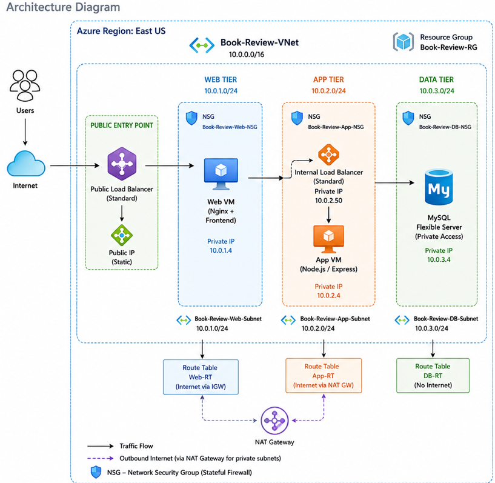
---

#### Screenshot 2 — Written architecture assumptions and selected Azure services

Architecture Assumptions

The Book Review application will be deployed on Microsoft Azure using a secure three-tier architecture. The following assumptions will guide the deployment:

All project resources will be deployed in the Poland Central Azure region.
A custom Virtual Network named Book-Review-VNet will be used with the address space 10.0.0.0/16.
The VNet will be divided into three isolated subnets:
Web Tier: Book-Review-Web-Subnet — 10.0.1.0/24
Application Tier: Book-Review-App-Subnet — 10.0.2.0/25
Database Tier: Book-Review-DB-Subnet — 10.0.3.0/26
Each tier will be protected by its own Network Security Group (NSG).
The Web Tier will be the only internet-facing tier and will host the frontend application and Nginx.
The Application Tier will remain private and will not have a public IP address. It will host the Node.js/Express backend.
The Database Tier will remain private and will use Azure Database for MySQL Flexible Server.
The App Tier will use a NAT Gateway for required outbound internet access without exposing the App VM with a public IP.
Database connections will use MySQL port 3306 with TLS/SSL encryption.
Administrative access to the private App VM will be performed through the Web VM acting as a jump host.
Network access will follow the principle of least privilege, allowing only the traffic required between the tiers.
Traffic Flow

Internet → Public Load Balancer → Web VM/Nginx → Internal Load Balancer → App VM/Node.js → MySQL Flexible Server

The Database Tier will not be directly accessible from the internet, while the Application Tier will only receive backend traffic from the Web Tier. This creates a layered security model across the application.

Selected Azure Services
Azure Service	Purpose
Azure Resource Group	Organizes and manages all resources belonging to the Book Review application.
Azure Virtual Network (VNet)	Provides the private network environment for communication between the three tiers.
Azure Subnets	Separates the Web, Application, and Database tiers into isolated network segments.
Network Security Groups (NSGs)	Provides firewall rules to control network traffic for each tier.
Azure Virtual Machines	Hosts the Web Tier (Nginx/frontend) and Application Tier (Node.js/Express).
Azure Database for MySQL Flexible Server	Provides managed MySQL database storage for the application.
Azure Public Load Balancer	Serves as the internet-facing entry point and forwards traffic to the Web Tier.
Azure Internal Load Balancer	Privately routes traffic from the Web Tier to the Application Tier.
Azure NAT Gateway	Provides outbound internet access for the private Application subnet without assigning a public IP to the App VM.
Azure Route Tables	Controls routing for the Web, Application, and Database subnets.
Azure Public IP	Provides a public IP address for the public-facing Load Balancer and NAT Gateway where required.
---

# Task 2 — Create the Azure Network Foundation

## Goal

Create a dedicated Resource Group and VNet with separate subnets for the web, application, and database tiers, keeping the application and database tiers without direct public access.

### Evidence

#### Screenshot 3 — Resource Group overview showing the assignment resources

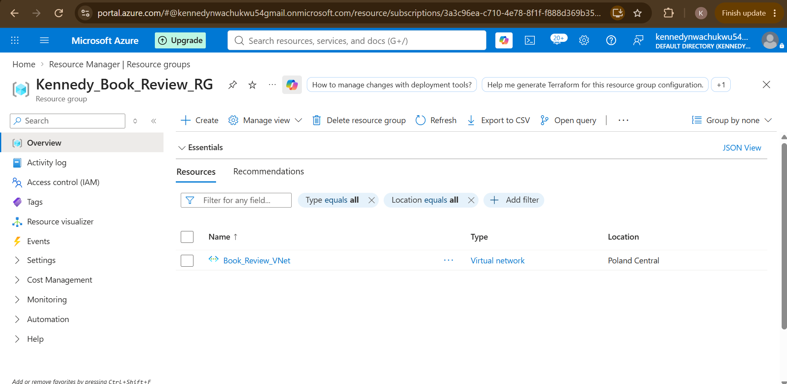
---

#### Screenshot 4 — VNet overview showing the address space and all required subnets

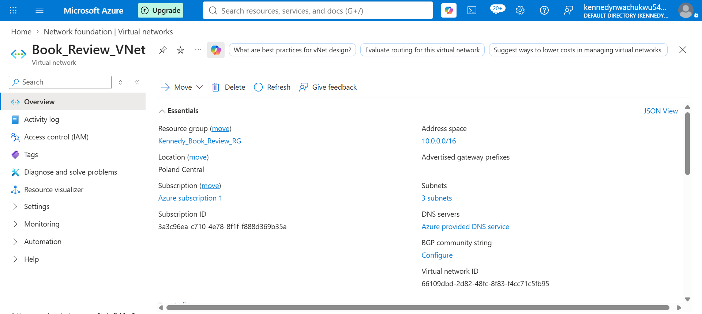
---

#### Screenshot 5 — Route-table or Private DNS evidence where applicable

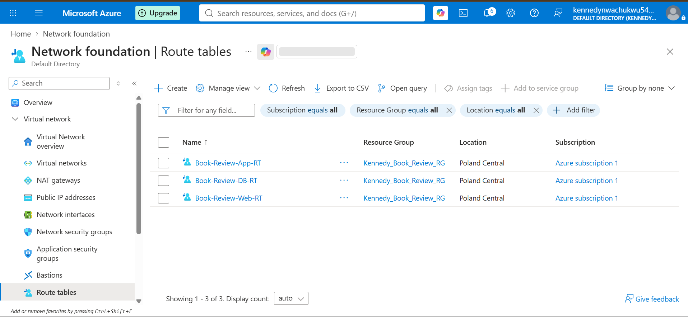
---

# Task 3 — Configure Security and Secret Management

## Goal

Apply least-privilege NSG rules so traffic flows Internet → public entry point → web tier → application tier → database tier, and store credentials in Azure Key Vault or another approved secure mechanism.

### Evidence

#### Screenshot 6 — NSG rules proving least-privilege access between the tiers

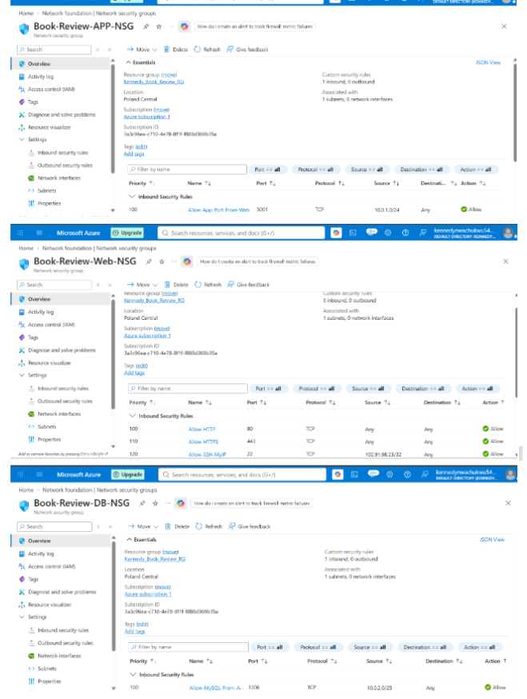
---

#### Screenshot 7 — Key Vault or approved secret-management configuration (without displaying secret values)

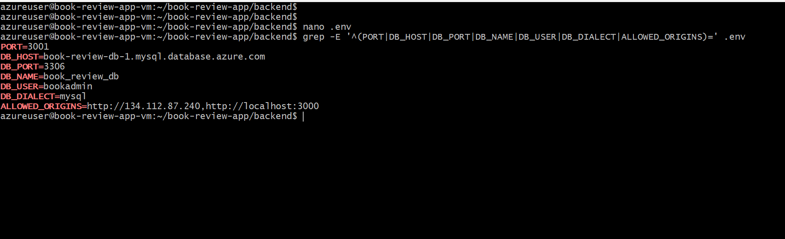
---

# Task 4 — Deploy the Presentation (Web) Tier

## Goal

Deploy the Book Review App presentation layer on the approved web-tier compute service, configured to route requests to the internal application-tier endpoint, and not directly exposed except through the public entry service.

### Evidence

#### Screenshot 8 — Web-tier compute overview showing subnet and availability configuration

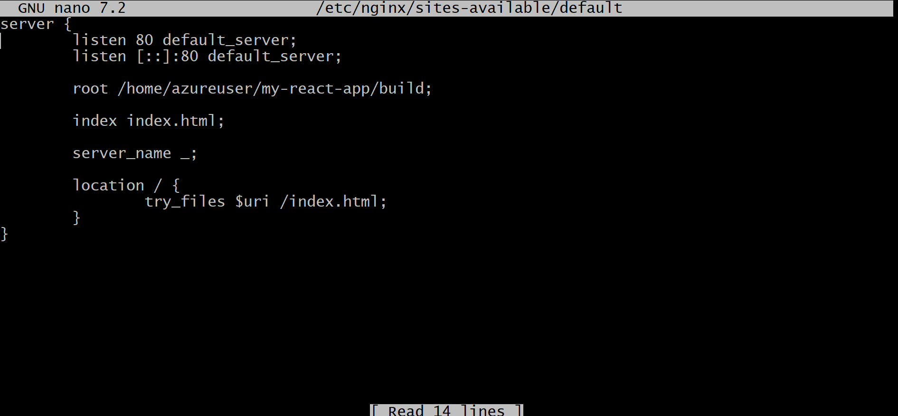
---

#### Screenshot 9 — Terminal or service output proving the presentation layer is running

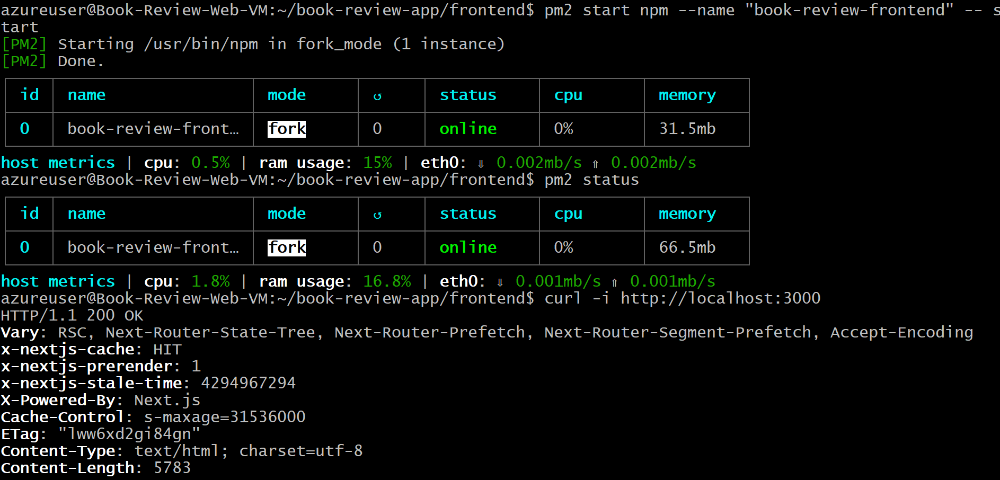
---

# Task 5 — Deploy the Business (Application) Tier

## Goal

Deploy the Book Review App backend privately in the application subnet, configured to use the private database endpoint and secured environment values, reachable only through its internal endpoint.

### Evidence

#### Screenshot 10 — Application-tier compute overview showing private subnet placement

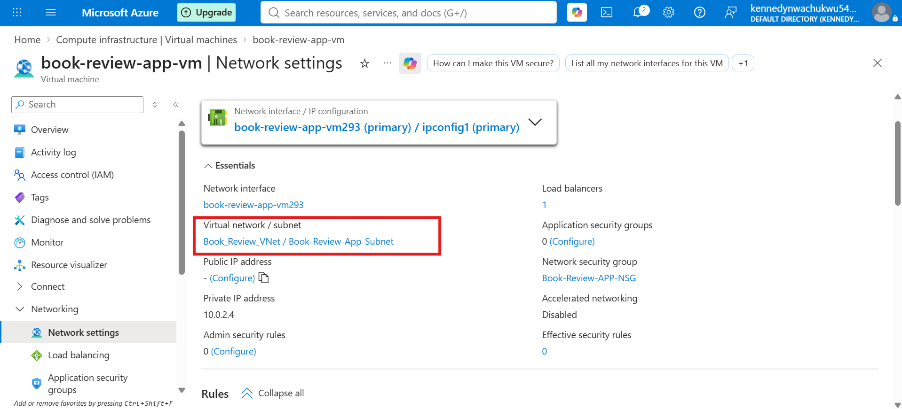
---

#### Screenshot 11 — Backend process, service, or listening-port evidence

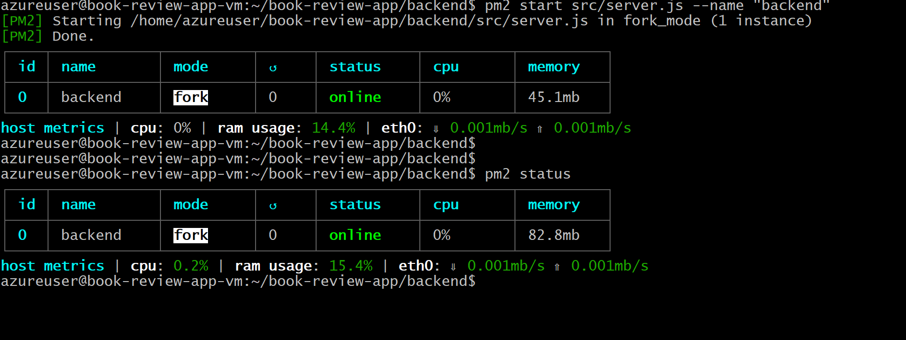
---

#### Screenshot 12 — Internal health-check or API response (without exposing secrets)

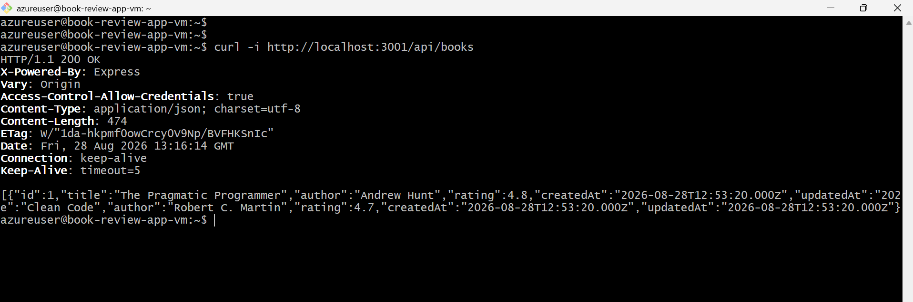
---

# Task 6 — Deploy the Managed Database Tier

## Goal

Create a private Azure managed database (public access disabled), with availability/backup/retention settings, the Book Review App schema imported, and access restricted to the application tier only.

### Evidence

#### Screenshot 13 — Database overview showing private connectivity and public access disabled

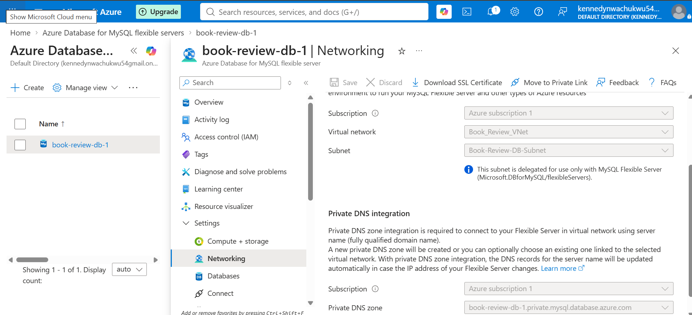
---

#### Screenshot 14 — Availability, backup, and retention configuration

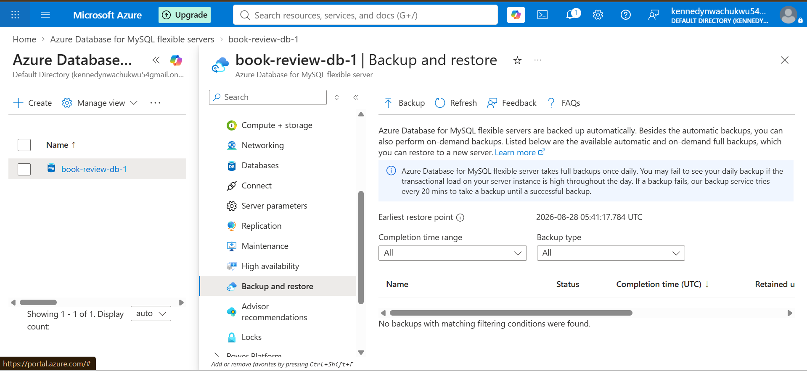
---

#### Screenshot 15 — Successful schema or connectivity verification (without exposing credentials)

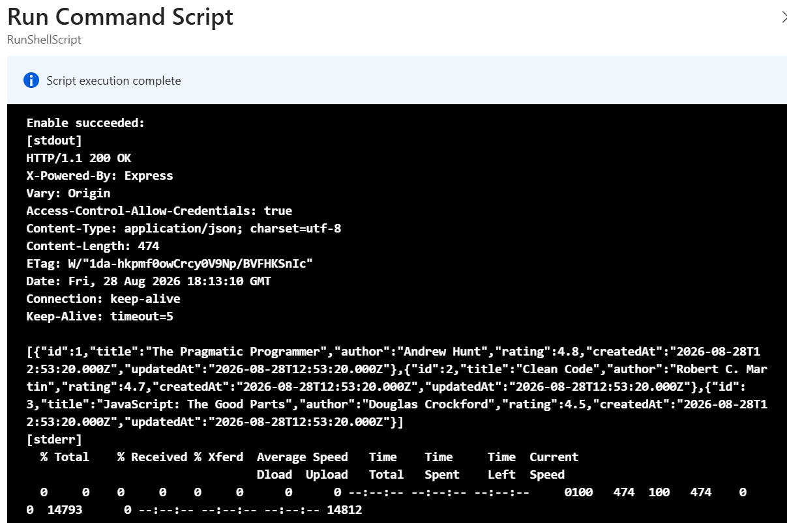
---

# Task 7 — Configure Traffic Management, Availability, and Monitoring

## Goal

Configure the approved public entry service with health probes and backend pools, internal routing for the application tier where required, and enable Azure Monitor/diagnostics/logs/alerts for the key resources.

### Evidence

#### Screenshot 16 — Public entry service showing listener, frontend endpoint, and healthy web targets

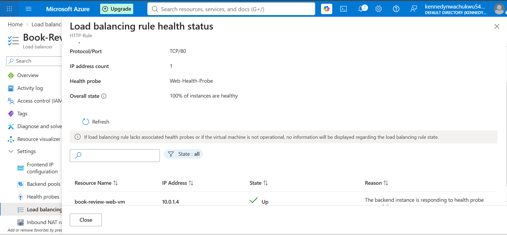
---

#### Screenshot 17 — Internal application-tier load-balancing or routing configuration where applicable

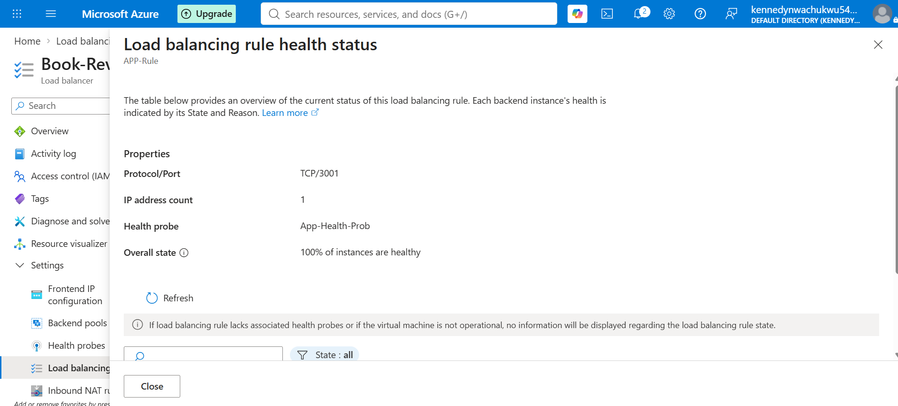
---

#### Screenshot 18 — Azure Monitor, diagnostic settings, logs, metrics, or alert evidence

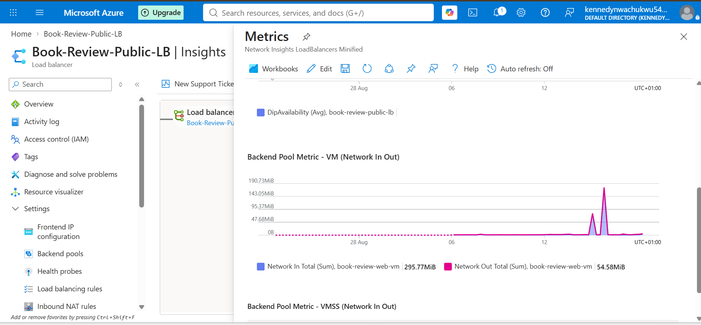
---

# Task 8 — Validate the Production-Style Deployment

## Goal

Confirm the Book Review App works end to end through the public endpoint, with at least one database read and one write, confirm private tiers are not internet-reachable, and complete a safe availability test.

### Evidence

#### Screenshot 19 — Browser showing the Book Review App through the public endpoint

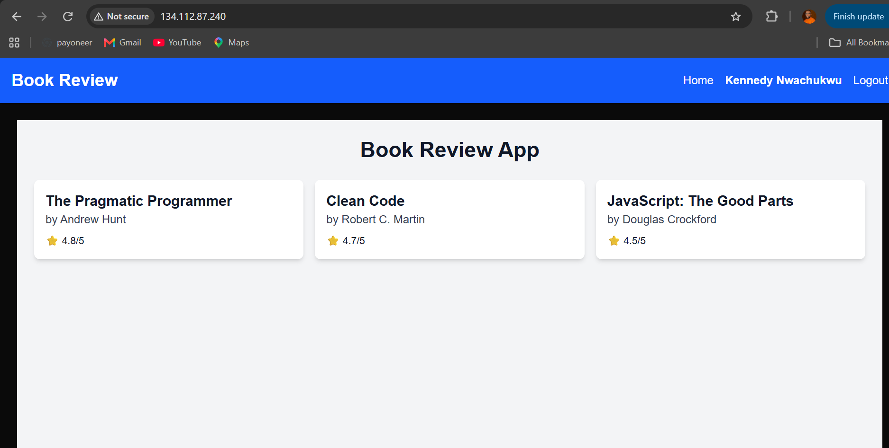
---

#### Screenshot 20 — Proof of successful database-backed read and write operations

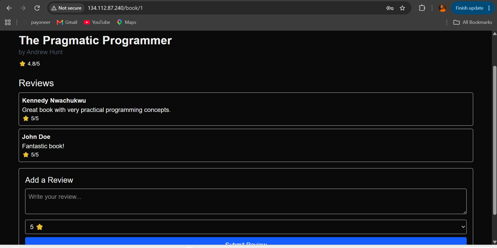
---

#### Screenshot 21 — Evidence that private tiers are not publicly accessible

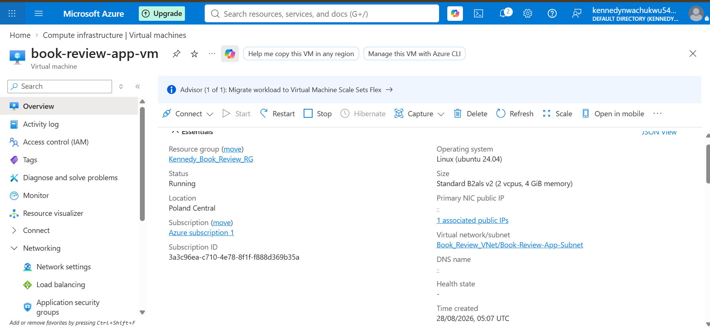
---

#### Screenshot 22 — Availability-test and healthy-target evidence

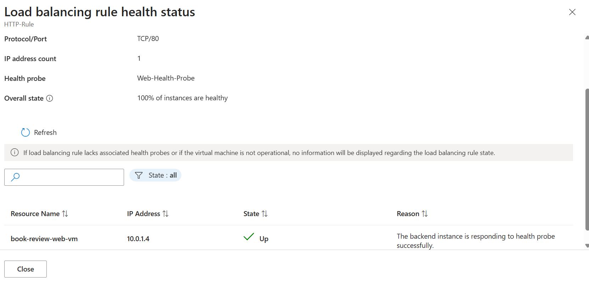
---

#### Public Endpoint

Paste your public endpoint URL here:

http://134.112.87.240
---

### Notes

Summarize what worked, issues encountered and how they were fixed, and the availability/security/secrets/monitoring/backup choices made.

The Book Review App was successfully deployed using a production-style three-tier architecture on Azure.

The presentation tier runs on the Web VM in the web subnet and is exposed through the Azure Standard Public Load Balancer. Nginx is configured as a reverse proxy, serving the Next.js frontend and routing `/api/` requests to the private application-tier endpoint.

The application tier runs privately on the App VM in the application subnet. The backend runs on port 3001 under PM2 and connects to the Azure Database for MySQL Flexible Server using the private database endpoint. The application database `book_review_db` was successfully connected and the application schema and sample data were populated.

An internal load-balancing configuration was used for the application tier, with the backend health probe reporting 100% healthy. The public load balancer also reports the Web VM as healthy, with 100% of instances healthy.

The deployment was validated end to end through the public endpoint. The application successfully displayed books retrieved from the database, and a database-backed write operation was also tested through the application.

Security was implemented by keeping the application tier on a private subnet with no public IP address and restricting direct internet access to the presentation tier. Environment variables were used to store database connection information and application configuration. No secret values are included in the submitted evidence.

Azure Monitor/Network Insights was also reviewed to verify load-balancer health and network activity. Available metrics included health-probe availability and backend network traffic.

One issue encountered during deployment was that the frontend initially requested `/api/api/books` because the frontend API URL already contained `/api` while the page code appended another `/api`. This was corrected so the frontend requests `/api/books`, after which the API returned HTTP 200 and the books displayed successfully.

The main availability and security choices were private application/database connectivity, health probes, load-balancer routing, PM2 process persistence, Nginx reverse proxying, and monitoring of the deployed resources.

---

# Submission Instructions

- Add all required screenshots and links in your submission
- Do not expose passwords, keys, connection strings, or subscription IDs

---

# Completion Checklist

- [ ] Task 1: Architecture diagram and assumptions documented (Screenshots 1–2)
- [ ] Task 2: Network foundation created with isolated tiers (Screenshots 3–5)
- [ ] Task 3: Least-privilege security and secret management configured (Screenshots 6–7)
- [ ] Task 4: Presentation tier deployed (Screenshots 8–9)
- [ ] Task 5: Application tier deployed privately (Screenshots 10–12)
- [ ] Task 6: Managed database tier deployed privately (Screenshots 13–15)
- [ ] Task 7: Public entry, internal routing, and monitoring configured (Screenshots 16–18)
- [ ] Task 8: End-to-end validation and availability test completed (Screenshots 19–22, Public Endpoint, Notes)
- [ ] No sensitive data exposed

---

## 📌 About DMI & CloudAdvisory

DevOps Micro Internship (DMI) is a project-based DevOps program run by Pravin Mishra (The CloudAdvisory) focused on real-world execution, systems thinking, and career readiness.

It helps learners build strong DevOps foundations with hands-on experience.

---

## 📌 Resources

- 🌐 DMI Official Website: https://dmi.pravinmishra.com?utm_source=github&utm_medium=readme  
- 🎓 University: https://university.pravinmishra.com?utm_source=github&utm_medium=readme  
- 💬 Discord Community: https://discord.pravinmishra.com?utm_source=github&utm_medium=readme  
- 📝 Blog: https://dmi.pravinmishra.com/blog?utm_source=github&utm_medium=readme  
- ▶️ YouTube Playlist: https://www.youtube.com/playlist?list=PLFeSNDtI4Cho  
- 🔗 Pravin Mishra (LinkedIn): https://www.linkedin.com/in/pravin-mishra-aws-trainer/  
- 🏢 CloudAdvisory (LinkedIn): https://www.linkedin.com/company/thecloudadvisory/

---

*This submission is part of DevOps Micro Internship (DMI) Cohort 3 — Agentic AI Track.*
